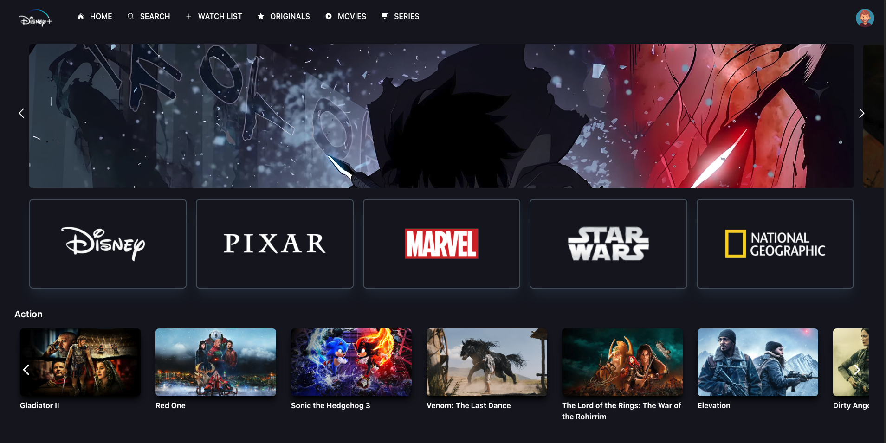

# 🌟 [Disney+ Clone](https://disney-stars.netlify.app/)

A modern web application replicating the functionality and design of **Disney+**, built with **React**, **TypeScript**, **Vite**, and **Tailwind CSS**. The project leverages **TMDB API** to fetch and display movies and series seamlessly.  

---

## 🖼️ **Screenshot**



## 🌐 **Live Demo**  
Check out the live version of the project here: [Disney Live Demo](https://disney-stars.netlify.app/)


## 🚀 **Features**

- 🎥 **Trending Movies/Series**: Display trending videos fetched from the TMDB API.
- 🔍 **Genre Filtering**: Browse and filter movies/series by genre.
- 🖼️ **Responsive Design**: Fully optimized for all screen sizes and devices.
- 🖱️ **Interactive UI**: Enjoy hover effects, smooth scrolling, and dynamic animations.
- 📽️ **Production House Showcase**: Explore production house logos with interactive video previews.

---

## 🛠️ **Tech Stack**

| **Category**   | **Technologies**                           |
|----------------|-------------------------------------------|
| Frontend       | React, TypeScript, Vite, Tailwind CSS     |
| API            | The Movie Database (TMDB) API             |
| Icons          | React Icons                               |

---

## 💻 **Installation**

1. Clone the repository:

   ```bash
   git clone https://github.com/yourusername/Disney.git
4. Navigate to the project directory:

   ```bash
   cd Disney

5. Install dependencies:

   ```bash
   npm install

6. Create a `.env` file in the root directory and add your TMDB API key:

   ```bash
   VITE_MOVIES_BASE_URL=https://api.themoviedb.org/3
   VITE_TMDB_API_KEY=your_api_key_here
   VITE_MOVIE_BY_GENRE_BASE_URL=https://api.themoviedb.org/3/discover/movie

7. Start the development server:

   ```bash
   npm run dev

8. Open your browser and navigate to:

   ```bash
   http://localhost:5173

🧑‍💻 API Integration
Fetch trending movies/series.
Filter movies by genres.
Showcase video previews for production houses.
📦 Available Scripts
In the project directory, you can run:

npm run dev: Start the development server.
npm run build: Build the project for production.
npm run preview: Preview the production build.
